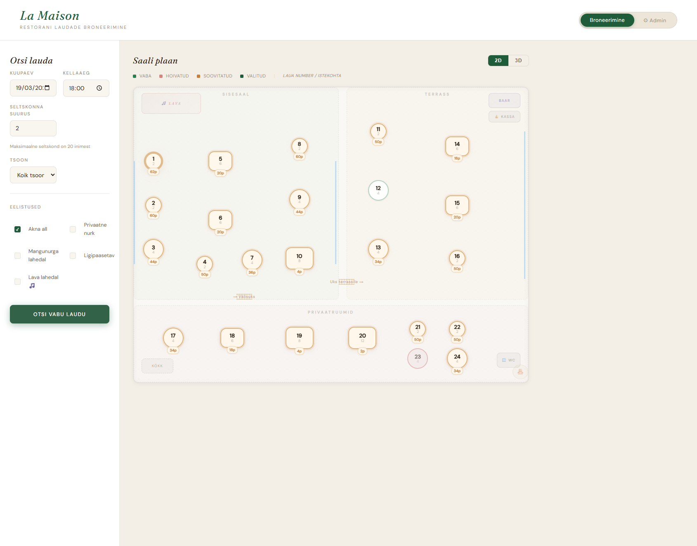
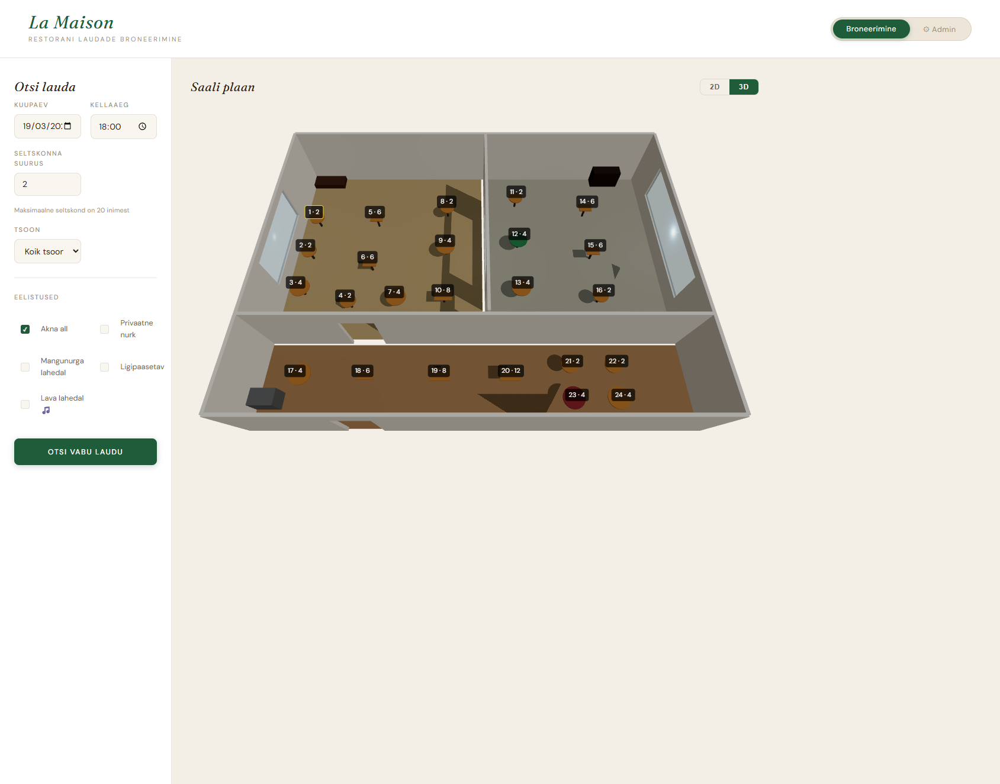
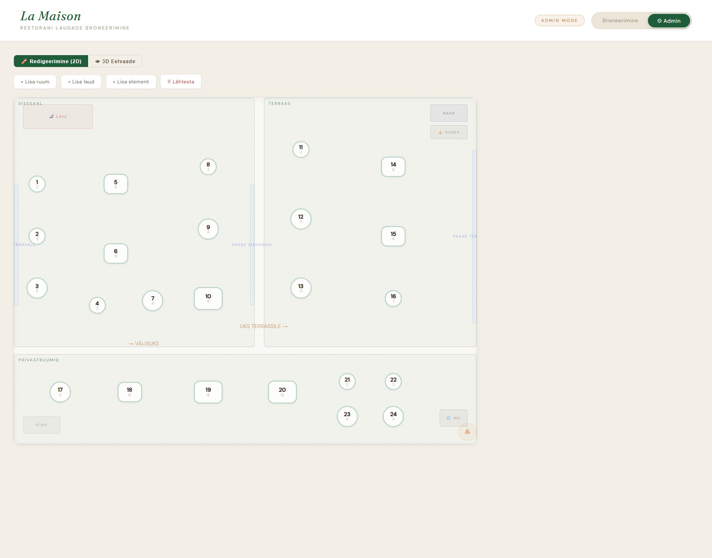

# La Maison — Smart Restaurant Reservation System

> CGI Summer Internship 2026 — Ivar Tammela

[](https://sonarcloud.io/summary/new_code?id=IvarTammela_restaurant)
[](https://sonarcloud.io/summary/new_code?id=IvarTammela_restaurant)
[](https://sonarcloud.io/summary/new_code?id=IvarTammela_restaurant)

A full-stack restaurant reservation app with an **interactive floor plan**, **score-based table recommendations**, and a **drag-and-drop admin editor**. Guests pick their ideal table visually — the algorithm finds the best match based on party size and seating preferences.

### Booking View (2D)



### 3D Floor Plan



### Admin Editor



---

## Table of Contents

- [Key Features](#key-features)
- [Tech Stack](#tech-stack)
- [Quick Start](#quick-start)
- [How the Recommendation Algorithm Works](#how-the-recommendation-algorithm-works)
- [API Reference](#api-reference)
- [Project Structure](#project-structure)
- [Known Limitations](#known-limitations)
- [Development Notes](#development-notes)
- [AI Tools Disclosure](#ai-tools-disclosure)

---

## Key Features

### Guest View

- **Visual floor plan** — three zones: Main Hall, Terrace, Private Rooms
- **2D ⇄ 3D toggle** — switch between classic 2D floor plan and interactive Three.js 3D view with orbital camera
- **Smart filters** — date, time, party size, zone
- **Preference matching** — window seat, private corner, near playground, accessible, near stage
- **Table recommendations** — score-based ranking (max 102 pts) considering size fit + preferences
- **Auto table merging** — for parties of 10+ the system suggests two adjacent tables
- **One-click booking** — click a table → confirm in the modal → done

### Admin View

- **Drag & drop** — reposition tables with auto-save
- **Add tables** — pick seat count and zone, click to place
- **Add rooms** — draw a new zone with your mouse
- **Floor elements** — bar, kitchen, stage, door, window, playground
- **Resize & rotate** — corner handle for resizing, top handle for rotation
- **Edit panel** — modify element name, dimensions, and rotation angle
- **3D preview** — toggle to Three.js 3D view to see how the layout looks from a guest's perspective

---

## Tech Stack

| Layer | Technology |
|-------|------------|
| Backend | Spring Boot 3.5.11, Java 21, JPA, Lombok |
| Database | H2 (in-memory) |
| Frontend | React 19, TypeScript, Vite 7 |
| 3D Engine | Three.js, @react-three/fiber, @react-three/drei |
| Styling | Custom CSS (light green/cream theme, responsive) |
| Testing | JUnit 5, MockMvc, AssertJ |
| Deployment | Docker (multi-stage build) |
| Code Quality | SonarCloud — all A ratings, 0% duplication |

---

## Quick Start

**Prerequisites:** Java 21+, Node.js 18+

### 1. Backend

```bash
./mvnw spring-boot:run
```

Starts at `http://localhost:8080`

H2 Console: `http://localhost:8080/h2-console`
- JDBC URL: `jdbc:h2:mem:restaurant`
- Username: `sa` / Password: *(empty)*

### 2. Frontend

```bash
cd frontend
npm install
npm run dev
```

Opens at `http://localhost:5173`

That's it — the app seeds 24 tables and ~12–16 random reservations on startup.

### Alternative: Docker

```bash
docker compose up --build
```

Opens at `http://localhost:8080` (backend serves the frontend build).

---

## How the Recommendation Algorithm Works

Each available table receives a score (max 102 points):

### Size Fit (max 50 pts)

| Condition | Score |
|-----------|-------|
| Seats = party size | 50 |
| Seats = party size + 1 | 42 |
| Seats = party size + 2 | 34 |
| Each additional extra seat | −8 |

A table with 6 extra seats scores only 2 pts — the algorithm strongly prefers a snug fit.

### Preference Bonus (max 50 pts)

Each matching preference adds **10 pts**: window seat, private corner, near playground, accessible, near stage.

### Accessibility Bonus

All accessible tables get **+2 pts** regardless of preferences.

### Table Merging

When `partySize > 10`, the system finds pairs of free tables within Euclidean distance < 35% of floor plan width and recommends the best-scoring combination.

---

## API Reference

### Tables

| Method | Endpoint | Description |
|--------|----------|-------------|
| `GET` | `/api/tables` | All tables |
| `GET` | `/api/tables/available` | Available tables (with filters) |
| `GET` | `/api/tables/recommend` | Scored recommendations |
| `POST` | `/api/tables` | Create table |
| `PUT` | `/api/tables/{id}` | Update table |
| `PUT` | `/api/tables/{id}/position` | Update position |
| `DELETE` | `/api/tables/{id}` | Delete table |

### Reservations

| Method | Endpoint | Description |
|--------|----------|-------------|
| `GET` | `/api/reservations` | All reservations |
| `POST` | `/api/reservations` | Create reservation |

### Rooms & Elements

| Method | Endpoint | Description |
|--------|----------|-------------|
| `GET` | `/api/rooms` | All zones |
| `GET` | `/api/elements` | All floor elements |
| `POST` | `/api/elements` | Create element |
| `PUT` | `/api/elements/{id}` | Update element |
| `DELETE` | `/api/elements/{id}` | Delete element |

---

## Project Structure

```
restaurant/
├── src/main/java/ee/ivar/tammela/restaurant/
│   ├── config/          # DataInitializer, WebConfig (CORS)
│   ├── controller/      # REST controllers
│   ├── dto/             # Data transfer objects
│   ├── model/           # JPA entities (Table, Reservation, Room, FloorElement)
│   ├── repository/      # Spring Data repositories
│   └── service/         # Business logic (scoring, merging)
└── frontend/src/
    ├── components/
    │   ├── FloorPlanWrapper.tsx      # 2D ⇄ 3D toggle
    │   ├── FloorPlan.tsx             # 2D guest floor plan
    │   ├── FloorPlan3D.tsx           # Three.js 3D floor plan
    │   ├── AdminFloorPlanWrapper.tsx  # Admin 2D + 3D preview
    │   ├── AdminFloorPlan.tsx        # Admin 2D editor
    │   ├── FilterPanel.tsx           # Search filters
    │   ├── ReservationModal.tsx      # Booking modal
    │   └── three/                    # 3D sub-components
    │       ├── Room.tsx              # Walls, floors, ceiling, windows, doors
    │       ├── Table3D.tsx           # 3D table with status colors
    │       ├── Lighting.tsx          # Ambient, directional, window lights
    │       └── Furniture.tsx         # Bar, stage, kitchen
    ├── api.ts           # API client
    └── types.ts         # TypeScript types
```

---

## Known Limitations

| Issue | Reason | Production Fix |
|-------|--------|----------------|
| Data resets on restart | H2 in-memory DB | Use PostgreSQL / MySQL |
| No authentication | Out of scope for prototype | Add JWT-based auth |
| Mobile support | Basic responsive layout added; complex admin editor works best on desktop | Full mobile redesign of admin drag-drop |
| Fixed visit duration | `endTime = startTime + 2h` | Let guests choose duration |

---

## Development Notes

**Total time:** ~8 hours (one evening + morning)

### Challenges Solved

- **Spring Boot from scratch** — no prior Java/Spring experience. Learned JPA annotations, dependency injection, and REST patterns from official docs + Baeldung.
- **Drag & drop** — HTML5 native drag API broke when the cursor left the element. Rewrote using document-level `mousemove`/`mouseup` listeners with `useRef` to avoid stale closures.
- **Algorithm calibration** — early version recommended oversized tables. Fixed by adding steep penalties for extra seats (−8 pts each).
- **CORS** — backend on `:8080`, frontend on `:5173`. Resolved with a `WebConfig` class using `@Configuration`.

### Design Decisions

- **Percentage-based positioning** (0–100%) for tables and elements, so the floor plan scales to any screen size.
- **Euclidean distance** for table merging — simpler and more intuitive than grid-based adjacency.
- **Random seed data** — `DataInitializer` creates realistic reservations on each startup for demo purposes.

---

## AI Tools Disclosure

This project was built with **Claude AI** (Anthropic) as a coding assistant:

- **Architecture & planning** — Claude helped design the project structure and technical approach
- **Backend code** — since Java/Spring Boot was new to me, Claude generated the foundational backend code (models, controllers, services), which I reviewed, understood, and directed
- **Frontend components** — React components and the dark gold CSS theme were AI-generated under my direction
- **Bug fixes** — used Claude for targeted SonarQube issue resolution

**My contributions:** project concept and feature design, all code review and approval, visual design and UX decisions, bug identification and fix direction, admin view concept (drag & drop, room creation), SonarCloud integration.

---

## License

This project is part of a CGI internship application and is publicly available for review.
